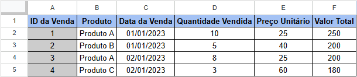

# Análise de Vendas

## Descrição

Este repositório contém a análise de dados de vendas de produtos. Foram gerados gráficos de barras para representar a quantidade vendida por produto, a variação de vendas (%), e um gráfico de linhas para mostrar a evolução das vendas totais ao longo dos meses. Também foram criadas tabelas dinâmicas de vendas por produto e por mês/ano.  

---

## Gráficos Gerados

1. **Gráfico de Barras - Quantidade Vendida por Produto**: Exibe a quantidade de vendas para cada produto ao longo do período.

2. **Gráfico de Barras - Variação de Vendas (%)**: Mostra a variação percentual das vendas de mês para mês.

3. **Gráfico de Linhas - Evolução das Vendas Totais por Mês**: Representa a evolução das vendas totais ao longo dos meses de 2023.

---

## Tecnologias Utilizadas

- Excel / Google Sheets (para tabelas dinâmicas)
